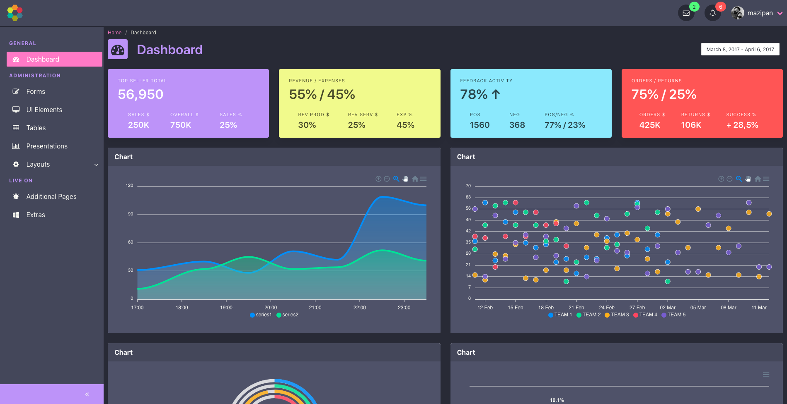

# :honeybee: Bulma Admin Dashboard Template

> Free admin dashboard template with bulma css

[](https://travis-ci.org/mazipan/bulma-admin-dashboard-template) 

## Demo

[https://mazipan.github.io/bulma-admin-dashboard-template/](https://mazipan.github.io/bulma-admin-dashboard-template/)

## Screenshoot



## Development

```
# Install pnpm
$ npm i -g pnpm

# Install dependencies
$ pnpm install

# Run in local
$ pnpm run dev
```

## Support me

- 👉 🇮🇩 [Trakteer](https://trakteer.id/mazipan?utm_source=github)
- 👉 🌍 [BuyMeACoffe](https://www.buymeacoffee.com/mazipan?utm_source=github)
- 👉 🌍 [Paypal](https://www.paypal.me/mazipan?utm_source=github)
- 👉 🌍 [Ko-Fi](https://ko-fi.com/mazipan)

## Contributing

If you'd like to contribute, head to the [contributing guidelines](/CONTRIBUTING.md). Inside you'll find directions for opening issues, coding standards, and notes on development.

---

Copyright © 2019 by Irfan Maulana
